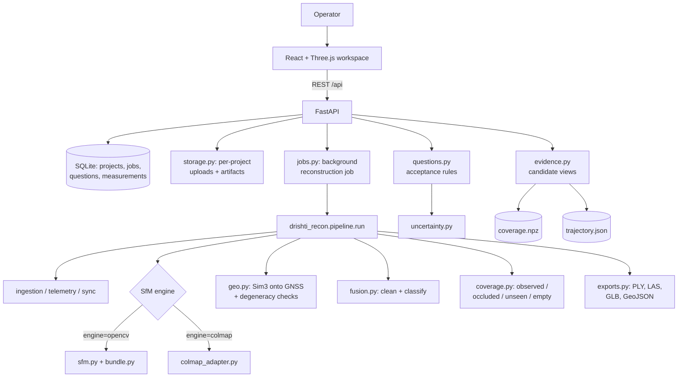

# Drishti3D — Project Overview

**Status of this document:** describes the system as it exists in this checkout
today. It is not a roadmap. Anything not implemented is in
[NEXT_STEPS.md](NEXT_STEPS.md).

Last updated: 2026-09-19.

---

## Project Goal

Drishti3D turns **one continuous drone video plus its telemetry** into a
georeferenced 3D reconstruction, and then lets an operator ask specific
geometric questions of it — a width, a height, a distance, a projected area —
at a **stated tolerance**, receiving either an answer with its evidence and
uncertainty, or a concrete explanation of which evidence is missing.

It targets problem statement **SIH26158 — Single-Pass Drone Video to Accurate 3D
Model Generation System**. The full product and research plan is
[DRISHTI3D_MVP_PLAN.md](DRISHTI3D_MVP_PLAN.md); this overview records what is
actually built.

**Who uses it:** a field mapping or infrastructure assessment team that needs
dimensions and coverage information before leaving a site.

**Inputs**

| Input | Form | Required |
|---|---|---|
| Video | MP4/MOV/WebM, one continuous pass | Yes |
| Telemetry | CSV (`timestamp,latitude,longitude,altitude,…`) or DJI `.SRT` | No — without it the result is shape-only, in arbitrary units |
| Camera calibration | `fx,fy,cx,cy` and optional distortion `k1,k2,p1,p2,k3` | No — estimated from frame size if absent, which costs accuracy |

**Outputs**

| Output | File | Notes |
|---|---|---|
| Colour point cloud | `point_cloud.ply`, `point_cloud.las`, `cloud.npz` | Per-point provenance class and propagated 1-sigma |
| Supported-surface mesh | `mesh.glb` | Visualisation; not measurement evidence |
| Camera trajectory | `trajectory.json/.csv/.geojson` | ENU poses, GNSS track, intrinsics |
| Coverage field | `coverage.npz`, `coverage.json` | Per-voxel observed / weak / occluded / unseen / verified-empty |
| Measurements | REST API, SQLite | Value, interval, acceptance status, reason codes |
| Quality report | `quality_report.html/.json` | Per-stage diagnostics and warnings |

**The central design commitment:** a number is reported with what supports it,
or it is refused with the reason. The system never fills an evidence gap with a
plausible value. Concretely, that is why the current deployment cannot report
"meets requirement" for any measurement at all — no interval calibration has
been validated yet, so the strongest honest verdict is *estimated only*. See
[DEC-003](DECISIONS.md#dec-003--acceptance-requires-a-validated-calibration-profile).

---

## Current Features

### Reconstruction pipeline
**What:** video + telemetry → georeferenced point cloud, mesh, trajectory,
coverage field, quality report.
**Where:** `drishti3d/reconstruction/drishti_recon/pipeline.py` — `run()`, a
fourteen-stage sequence (ingestion → telemetry → frames → quality → sync →
keyframes → masking → SfM → densify → georegistration → fusion → mesh → report
→ exports).
**Depends on:** `ingestion.py`, `telemetry.py`, `sync.py`, `frame_quality.py`,
`keyframes.py`, `features.py`, `sfm.py`, `bundle.py`, `colmap_adapter.py`,
`geo.py`, `fusion.py`, `mesh.py`, `coverage.py`, `exports.py`.

### Two interchangeable SfM engines
**What:** the repository's own incremental SfM (`sfm.py` + `bundle.py`), and
COLMAP via PyCOLMAP (`colmap_adapter.py`), selectable per run with
`PipelineParams.engine`.
**Measured 2026-09-19** on the real AGZ single-pass mission: COLMAP is 3.5×
faster and roughly 2× more accurate in shape. See
[TESTS_AND_RESULTS.md](TESTS_AND_RESULTS.md#agz-single-pass-engine-comparison).
The OpenCV engine remains the always-available CPU fallback.

### Telemetry-aware georeferencing with degeneracy checks
**What:** robust covariance-weighted Sim(3) alignment of reconstructed camera
centres onto the GNSS track, with explicit conditioning tests, a scale
uncertainty estimate, and a gravity-levelling step that is *rejected* when it
worsens the GNSS residual.
**Where:** `geo.py` (`robust_sim3`, `umeyama_sim3`, `ENUFrame`),
`pipeline.py` georegistration stage.

### Provenance-classified geometry
**What:** every point carries one of six provenance classes
(`OBSERVED_HIGH_CONFIDENCE`, `OBSERVED_LOW_CONFIDENCE`, `AI_ASSISTED`,
`DYNAMIC_EXCLUDED`, `UNOBSERVED`, `AI_GEOMETRICALLY_VERIFIED`). Measurements use
observed geometry by default and flag anything else.
**Where:** `provenance.py`, `fusion.py`.

### Propagated measurement uncertainty
**What:** per-point covariance from the reconstruction, propagated into distance,
height and area measurements including the metric-scale term.
**Where:** `uncertainty.py` (`point_covariances`, `distance_uncertainty`,
`height_uncertainty`, `area_uncertainty`, `calibrate`), `measure.py`.

### Coverage field with a positive free-space rule
**What:** a voxel field classifying the mission volume as observed / weak /
occluded / unseen / dynamic-excluded / verified-empty. **Free space is
established only where a ray passed through the cell and terminated on a
finite, supported depth** — a hole in a sparse cloud is unknown, not clear.
**Where:** `coverage.py` (`build`, `CoverageGrid.is_measurable`).

### Measurement questions and the tolerance gate
**What:** an operator asks a geometry question *with a tolerance*; the backend
returns the value, its interval, an acceptance status
(`meets_requirement` / `estimated_only` / `needs_refinement` /
`not_observable`), reason codes, and a concrete next action for each reason.
Changing the tolerance re-decides the verdict without re-running geometry.
**Where:** `questions.py` (the rules), `backend/app/routers/questions.py` (the
API), `backend/app/models.py` (`MeasurementQuestion`, `Measurement`).

### Candidate-view evidence
**What:** for any selected point, which cameras could see it, how much parallax
they provide, whether it lies in established coverage, and a diversity-ranked
list of supporting frames.
**Where:** `evidence.py` (`ReconstructionEvidence`).
**Known limit:** support is derived from camera frustums plus the coverage
grid, **not** from the image observations that produced the point — the cloud
carries no observation lineage yet. Every such record is stamped
`view_support_basis="frustum_upper_bound"`, and that stamp blocks acceptance.

### Dataset tooling
**What:** inventory of every dataset in the checkout with content digests, LFS
stub detection and flown-geometry statistics; a builder that turns an AGZ frame
subset into a plan-conformant mission with real presentation timestamps and
access-separated reference data; a runner that reconstructs a mission and scores
it against held-out references.
**Where:** `drishti3d/scripts/inventory_datasets.py`,
`drishti3d/scripts/build_agz_mission.py`, `drishti3d/scripts/run_mission.py`,
`drishti3d/scripts/agz_logs.py`. Outputs land in `datasets/`.

### REST API and web workspace
**What:** project CRUD, upload, processing jobs with progress, artifact
download, measurements, measurement questions. React + Three.js viewer.
**Where:** `drishti3d/backend/app/`, `drishti3d/frontend/src/`.

### Optional learned components
**What:** MASt3R dense backend (`dense3d.py`), VGGT (`vggt_engine.py`),
monocular depth prior (`depth_prior.py`), LightGlue/DISK matching
(`features.py`), semantic and optical-flow dynamic masking (`masking.py`).
All are opt-in and off by default. Weights are not bundled.

---

## Tech Stack

### FastAPI
Backend API framework. **Why:** async support, automatic OpenAPI generation,
Pydantic validation at the boundary, and it stays out of the way of a
compute-heavy worker. **Used in:** `backend/app/main.py`,
`backend/app/routers/`.

### SQLAlchemy + SQLite
Metadata persistence: projects, jobs, measurements, measurement questions.
**Why:** a single workstation deployment does not justify a server database, and
SQLite is a file that can be copied with the mission. **Alternative when
concurrency or spatial queries arrive:** PostgreSQL + PostGIS.
**Used in:** `backend/app/db.py`, `backend/app/models.py`.

### OpenCV (`opencv-python` 5.0)
Decoding, feature detection and matching, PnP, triangulation, undistortion.
**Why:** the classical geometry machinery is mature, CPU-only, and has no
licence encumbrance. **Used in:** `sfm.py`, `features.py`, `sensors.py`,
`pipeline.py`.

### PyCOLMAP 4.2
The second SfM engine. **Why:** COLMAP's incremental mapper and bundle
adjustment are the field reference, and on real data here they are both faster
and more accurate than the in-repo engine.
**Used in:** `colmap_adapter.py`.

### NumPy / SciPy
Linear algebra, sparse least squares for bundle adjustment, KD-trees for
snapping and outlier removal. **Used in:** everywhere in
`reconstruction/drishti_recon/`.

### PyTorch 2.11 (CUDA 12.8)
Only for the optional learned components. **Why:** the pretrained models that
exist are PyTorch. It is not on the critical path — the classical pipeline runs
without a GPU. **Used in:** `dense3d.py`, `vggt_engine.py`, `depth_prior.py`,
`masking.py`, `features.py` (LightGlue).

### pyproj
CRS transforms for scoring and export (WGS 84 ↔ UTM). **Used in:**
`scripts/run_mission.py`, `exports.py`.

### FFmpeg / ffprobe
Container probing and mission video construction with explicit per-frame
presentation timestamps. **Used in:** `ingestion.py`,
`scripts/build_agz_mission.py`, `scripts/inventory_datasets.py`.

### React + Vite + Three.js
The operator workspace and 3D viewer. **Why:** the viewer needs real-time
point-cloud rendering in a browser. **Used in:** `frontend/src/`.

---

## Architecture



The dependency direction is one-way: the API calls the geometry service, and
rendering never determines measurement validity. The frontend displays a status;
it never computes one.

---

## Directory Structure

```text
Drishti3D/
├── DRISHTI3D_MVP_PLAN.md        the product and research plan being executed
├── PROJECT_OVERVIEW.md          this file
├── DECISIONS.md  WORKLOG.md  SYSTEM_FLOW.md
├── TESTS_AND_RESULTS.md  NEXT_STEPS.md
├── datasets/                    plan section 6.6 data layout
│   ├── catalog.csv              machine-readable inventory (tracked)
│   ├── INVENTORY.md             the same, with caveats (tracked)
│   ├── public/<set>/<mission>/  built missions: raw/, calibration/, manifest
│   ├── truth/<mission>/         reference data — never given to the worker
│   └── splits/                  development / calibration / locked test
└── drishti3d/
    ├── backend/app/             FastAPI: routers, models, jobs, storage
    ├── reconstruction/drishti_recon/   the geometry and measurement library
    ├── frontend/src/            React + Three.js workspace
    ├── scripts/                 dataset inventory, mission build, mission run
    ├── eval/                    benchmark harness, calibration, metrics
    ├── tests/                   pytest suite
    ├── data/                    local DB, project artifacts, raw captures
    └── docs/                    engineering docs and archived benchmarks
```

**Responsibilities**

- `reconstruction/drishti_recon/` — all geometry, uncertainty and acceptance
  logic. Has no dependency on the web layer and is usable as a library.
- `backend/app/` — persistence, job orchestration, HTTP. Contains no geometry.
- `scripts/` — operator-facing tooling that stands outside the request path.
- `datasets/truth/` — evaluation data. **Never mounted into the worker.**

---

## Important Files

`drishti3d/reconstruction/drishti_recon/pipeline.py`
The reconstruction entry point. `run(project_dir, video, telemetry, params)`
executes every stage and writes the artifact set.

`drishti3d/reconstruction/drishti_recon/questions.py`
The acceptance gate: `Status`, `Reason`, `CalibrationProfile`,
`MeasurementQuestion`, `Evidence`, and `evaluate()`. Read this first to
understand what the product will and will not claim.

`drishti3d/reconstruction/drishti_recon/evidence.py`
`ReconstructionEvidence` — candidate views, parallax, coverage membership and
supporting frames for a selected point.

`drishti3d/reconstruction/drishti_recon/coverage.py`
The unknown-space map and the free-space rule.

`drishti3d/backend/app/main.py`
FastAPI application; runs `init_db()` on startup.

`drishti3d/backend/app/db.py`
Engine, session, `init_db()` and `_add_missing_columns()` — an additive-only
startup migration for the development SQLite database.

`drishti3d/backend/app/config.py`
Reads `DRISHTI_DATA_DIR` and derives the data, project and database paths.

`drishti3d/scripts/build_agz_mission.py`
Builds a mission in the `datasets/` layout from an AGZ frame subset.

`drishti3d/scripts/run_mission.py`
Reconstructs a mission and scores it against `datasets/truth/`.

---

## How To Run

### Dependencies

There is no `requirements.txt`; the canonical build is
`drishti3d/docs/ENVIRONMENT.md`, reproduced here:

```bash
cd drishti3d
uv venv --python 3.12 .venv                 # 3.14 has no OpenCV wheel yet
VIRTUAL_ENV=.venv uv pip install \
    numpy scipy "opencv-python-headless>=4.8" pyproj imageio imageio-ffmpeg \
    fastapi "uvicorn[standard]" sqlalchemy pydantic python-multipart aiofiles \
    httpx laspy open3d pytest pyyaml
VIRTUAL_ENV=.venv uv pip install -e reconstruction
VIRTUAL_ENV=.venv uv pip install pycolmap    # the reference SfM engine
```

`pip` works identically. FFmpeg and ffprobe must be on `PATH` for ingestion and
for `scripts/build_agz_mission.py`.

Verified in this checkout: Python 3.12.14, NumPy 2.5.2, OpenCV 5.0.0,
PyCOLMAP 4.2.0, PyTorch 2.11.0+cu128 (CUDA available), FastAPI 0.141.1,
pyproj 3.7.2, FFmpeg on `PATH`.

### Environment variables

| Variable | Meaning |
|---|---|
| `DRISHTI_DATA_DIR` | Root for the SQLite database and per-project artifacts. Defaults to `drishti3d/data`. |
| `DRISHTI_SEG_WEIGHTS` | Path to a local torchvision segmentation checkpoint for semantic dynamic masking. Optional. |

No secrets are required. Do not commit any.

### Backend

```bash
cd drishti3d
.venv/bin/uvicorn backend.app.main:app --reload --port 8000
# OpenAPI at http://localhost:8000/docs
```

### Frontend

```bash
cd drishti3d/frontend
npm install
npm run dev            # Vite dev server, proxies /api to :8000
```

### Tests

```bash
cd drishti3d
.venv/bin/python -m pytest tests/ -q
```
256 tests, ~110 s on this machine as of 2026-09-19.

### Dataset and mission workflow

```bash
cd drishti3d
# 1. what is on disk, with digests and flown geometry
.venv/bin/python scripts/inventory_datasets.py          # --no-hash to skip digests

# 2. build a mission from an AGZ frame subset
.venv/bin/python scripts/build_agz_mission.py \
    --source data/real_drone/agz_dense --name agz_dense_pass --overwrite

# 3. reconstruct it and score against the held-out reference
.venv/bin/python scripts/run_mission.py \
    --mission agz_dense_pass --engine colmap --max-frames 184 --tag colmap_full
```

---

## Current System State

### What works

- End-to-end reconstruction from a real single-pass aerial video with real
  consumer-grade GNSS, producing a georeferenced cloud, mesh, trajectory,
  coverage field and exports. Measured on the AGZ mission: 86 s wall with the
  COLMAP engine, 291 s with the OpenCV engine.
- Two SfM engines with a measured comparison on identical input.
- Telemetry-aware scale and georeferencing, with the scale's own uncertainty
  reported and conditioning tested.
- Propagated uncertainty from point covariance through distance, height and
  area, including the scale term.
- Coverage classification that keeps unknown space unknown.
- Measurement questions with tolerance, acceptance status, reason codes and
  actionable guidance, re-decidable at a new tolerance without re-running
  geometry.
- Candidate-view evidence for any selected point.
- Reproducible dataset inventory, mission construction and scoring, with
  reference data access-separated from the worker.

### What does not work yet

- **Nothing can be accepted.** No calibration profile has been fitted or
  validated for any capture regime, so every verdict is at best
  `estimated_only`. This is deliberate, not a defect ([DEC-003](DECISIONS.md)).
- **No observation lineage.** The point cloud does not record which image
  observations produced each point, so evidence is candidate views rather than
  actual support, and Evidence Replay (plan F3) cannot show the pixels that
  made a measurement.
- **No same-pass refinement** (plan F4). `Improve this measurement` does not
  exist.
- **No measurement passport or verifier** (plan F3).
- **No Tolerance Lens UI.** The backend gate exists; the frontend does not
  render it yet.
- **Registration is poor on real data.** Keyframe selection kept 80 of 184
  frames on the AGZ mission and SfM registered all 80, so 104 frames of the
  pass contributed nothing.
- **Georeferenced accuracy is GNSS-bound.** Median 3.7 m against the AGZ
  reference, with a 5% scale uncertainty from a ±9.4 m eph receiver. Centimetre
  claims are not available from this capture.
- **No field data.** There is no capture with independently measured checkpoints
  or reference dimensions, so no positional accuracy class can be assessed.
