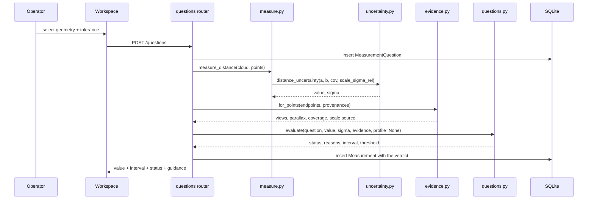

# System Flow

How work actually executes through Drishti3D, with the real module, function
and endpoint names. Read [PROJECT_OVERVIEW.md](PROJECT_OVERVIEW.md) first for
what the components are.

Last updated: 2026-09-19.

---

## 1. Reconstruction: video and telemetry to artifacts

### Entry point

`drishti_recon.pipeline.run(project_dir, video_path, telemetry_path, *, params, progress)`
in `drishti3d/reconstruction/drishti_recon/pipeline.py`.

Called from two places: the backend job worker (`backend/app/jobs.py`) and the
mission runner (`drishti3d/scripts/run_mission.py`). Both pass a
`PipelineParams` and a progress callback; nothing else differs.

### Stage sequence

```text
video + telemetry + PipelineParams
 ↓ 1  ingestion      ingestion.probe        container facts, sha256
 ↓ 2  telemetry      telemetry.load         samples, or relative-scale mode
 ↓ 3  frames         cv2.VideoCapture       decode, stride, downscale, PTS
 ↓ 3b timing         _adopt_pts             real timestamps, or nominal clock
 ↓ 3c intrinsics     _resolve_intrinsics    override -> telemetry -> estimate
 ↓ 4a undistort      sensors.undistort_frames  once, K updated
 ↓ 4  quality        frame_quality.analyze  blur, exposure, acceptance
 ↓ 5  sync           sync.synchronize       frame time -> GNSS sample
 ↓ 6  keyframes      keyframes.select       the frames SfM will see
 ↓ 7  masking        masking.*              optional dynamic-object masks
 ↓ 8  sfm            sfm.reconstruct   OR   colmap_adapter.*
 ↓ 9  densify        depth_prior / dense3d  optional, off by default
 ↓10  georegistration geo.robust_sim3       recon frame -> ENU, scale + sigma
 ↓10b levelling      gravity align          applied only if it helps the fit
 ↓11  fusion         fusion.fuse            voxel, outliers, provenance
 ↓12  mesh           mesh.*                 supported surfaces only
 ↓12b coverage       coverage.build         observed/weak/occluded/unseen/empty
 ↓13  report         quality report assembly
 ↓13b lineage        _remap_observations    track observations -> fused indices
 ↓14  exports        _write_artifacts       PLY, LAS, GLB, GeoJSON, viewer,
                                            trajectory, manifest, observations
```

### Stage detail where behaviour is non-obvious

**3 / 3b — frame timing.** The decode loop samples `CAP_PROP_POS_MSEC` both
before and after each `cap.read()` and keeps both series. `_adopt_pts` picks the
self-consistent one: the pre-read series when it is strictly increasing and not
all zero, otherwise the post-read series, otherwise `frame_index / fps` with a
warning. Backends disagree about which frame the property names, and on OpenCV
5.0.0 here the pre-read value lags by one frame. See
[DEC-005](DECISIONS.md#dec-005--frame-timestamps-are-read-after-decode-and-the-backend-convention-is-detected-rather-than-assumed).

A PTS track is rejected if it is all zeros, non-monotonic, or spans a duration
inconsistent with frame count and nominal rate by more than 2×.

**4a — undistortion.** Applied once, up front, with `alpha=0` so no black border
pixels enter feature detection. `K` is replaced with the undistorted camera's
intrinsics and the rest of the pipeline assumes a pinhole. Threading distortion
through triangulation, PnP, BA and uncertainty would need a distortion-aware
variant of each, and a missed one would fail silently.

**10 — georegistration.** `geo.robust_sim3` fits a similarity from the
reconstruction frame onto the GNSS camera track, weighted by per-sample
covariance, with RANSAC-style inlier selection. It reports `scale`,
`scale_sigma`, `alignment_rmse_3d_m`, a degeneracy flag and a `conditioning`
block (principal extents, extent ratios). The alignment RMSE is **not**
independent accuracy — it measures consistency between reconstructed camera
centres and the GNSS that was fitted to them — and the report says so in its
own `note` field.

**10b — gravity levelling.** Computed, then accepted only if it does not raise
the GNSS alignment residual. On the AGZ mission it was rejected: levelling would
have moved the residual from 6.14 m to 14.97 m, and the run warning records
that.

**12b — coverage.** Per camera, a dilated z-buffer of the cloud. A cell is
*visible* where a finite depth returned and the cell is no further than
`nearest + occlusion_tol`. A cell is *free* only where a finite depth returned
and the cell is strictly nearer than `nearest - occlusion_tol`. Only the second
produces `EMPTY`. See
[DEC-004](DECISIONS.md#dec-004--verified-free-space-requires-a-finite-depth-return).

**13b — observation lineage.** Both SfM engines emit, per point, the image
measurements that produced it: `obs_point` indexes the pre-fusion point array,
`obs_frame` is the keyframe index, `obs_uv` the pixel at solving resolution.
Fusion reindexes the cloud, so `PointCloud.source_index` maps each survivor back
to its input row and `_remap_observations` inverts that map. Observations whose
point did not survive are dropped rather than reassigned — a discarded point's
measurements are not evidence for whatever took its place. Each surviving row is
written with **both** frame numberings: the solver's keyframe index and the
decoded frame index that `sel` maps it to. See
[DEC-009](DECISIONS.md#dec-009--observation-lineage-is-carried-as-a-separate-artifact-and-a-merged-away-point-donates-nothing).

### Artifacts written

`cloud.npz` (points, colors, confidence, provenance, sigma, sigma_major),
`point_cloud.ply`, `point_cloud.las`, `mesh.glb`, `viewer.json`,
`trajectory.json` (ENU frame, `K`, `image_size`, per-camera `C` and `R`, GNSS
track), `trajectory.csv`, `trajectory.geojson`, `coverage.npz`,
`coverage.json`, `frame_metrics.json`, `keyframes.json`,
`quality_report.json/.html`, `manifest.json`, `observations.npz`
(`point_index`, `keyframe_index`, `frame_index`, `uv`, plus the image size the
pixels are in).

`manifest.json` carries the video hash, the full parameter set, every spatial
transform applied, the vertical datum, the frame timing source, and the
alignment block — so an exported coordinate can be traced back to the fit that
produced it.

### Error handling

Stage failures raise and abort the run; `jobs.py` records the exception on the
`Job` row and marks the project `failed`. No partial artifact set is presented
as complete. Two stages degrade instead of failing: LAS export appends a
warning and continues if it cannot write, and missing telemetry switches the
whole run to relative-scale mode with an explicit warning that the result is
shape-only and not georeferenced.

---

## 2. Asking a measurement question

### Flow

```text
Operator selects geometry + tolerance in the workspace
 ↓
POST /api/projects/{id}/questions
 ↓  backend/app/routers/questions.py :: create_question
 ↓  validate kind and tolerance          -> 400 on bad input
 ↓  persist MeasurementQuestion row      (the ask, stored apart from any answer)
 ↓
_answer(project_id, row, db)
 ├─ measurements.load_cloud(pid)         cloud.npz incl. sigma, sigma_major
 ├─ _evidence_for(pid)                   ReconstructionEvidence.load(artifacts)
 ├─ measure.measure_distance|height|area|point
 │     └─ uncertainty.distance_uncertainty(...)  value + 1-sigma
 ├─ _snapped_provenance(...)             provenance of each snapped point
 ├─ evidence.for_points(...)             views, parallax, coverage, scale
 ├─ questions.evaluate(question, value, sigma, evidence, profile=None)
 │     └─ Status + [Reason] + interval + threshold + dominant limitation
 └─ persist Measurement row              value, sigma, interval, status,
                                         reasons, evidence, artifact_version
 ↓
QuestionOut: the ask, the result, and guidance for every reason code
```



### The acceptance decision, in order

`questions.evaluate()`:

0. **Support basis.** `Evidence.view_support_basis` is
   `triangulated_observations` when every endpoint resolved to observation
   lineage, `frustum_upper_bound` otherwise. The latter adds a blocking reason.
1. **Hard refusals → `NOT_OBSERVABLE`.** `value is None`; endpoint not on
   observed geometry; endpoint outside established coverage; measurement touches
   inferred geometry; sigma non-finite. Any of these and no number is presented
   as a measurement.
2. **Soft limitations** are collected: dynamic contamination; ray separation
   below `MIN_RAY_SEPARATION_DEG` (2°); fewer than `MIN_SUPPORTING_VIEWS` (3)
   views; no scale source; view support not derived from observation lineage;
   no usable calibration profile.
3. **Interval.** Calibrated half-width from the profile when one is usable,
   otherwise `z(level) · sigma` labelled `uncalibrated_sensitivity`.
4. **Scale dominance.** If `scale_sigma_rel · |value| · z(level)` already exceeds
   the tolerance, `SCALE_UNCERTAINTY_DOMINATES` is added — a distinct failure,
   because local refinement cannot repair a multiplier on the whole model.
5. **Threshold**, if asked: `above` / `below` only when the whole interval is on
   one side, `indeterminate` otherwise.
6. **Status.** No tolerance → `ESTIMATED_ONLY`. Interval wider than tolerance →
   `NEEDS_REFINEMENT`. Interval fits and calibrated and nothing blocking →
   `MEETS_REQUIREMENT`. Otherwise → `ESTIMATED_ONLY`.

**Today, step 6 never reaches `MEETS_REQUIREMENT`**, because the backend passes
`profile=None` — no calibration profile has been fitted for any capture regime
([DEC-003](DECISIONS.md)). Since observation lineage landed, that is the only
remaining blocker on real reconstructions: on the AGZ mission a well-supported
3 m span returns `estimated_only` with the single reason
`interval_not_calibrated`.

### Changing the tolerance

```text
PATCH /api/projects/{id}/questions/{qid}   {"tolerance_m": 0.05}
 ↓  update the question row (tolerance / level / threshold / label only)
 ↓  load the latest stored Measurement
 ├─ artifact_version matches current?  -> re-run questions.evaluate on the
 │                                        STORED value, sigma and evidence
 └─ no result, or geometry changed?    -> _answer() re-measures from scratch
```

The selection cannot be changed here. Moving the endpoints is a different
question, and reusing the old identity would make its history wrong. The
measurement and its interval are unchanged by a tolerance change; only the
verdict moves. `test_changing_tolerance_moves_the_status_not_the_value` asserts
exactly that.

### Security and validation

`storage.project_dir()` rejects path traversal in project IDs;
`storage.sanitize_filename()` strips separators from uploads. Question kind is
checked against a closed set, tolerance must be positive, and every project ID
is resolved through the ORM before any filesystem access. There is no
authentication layer — the application is single-user and local, and multi-user
exposure needs the hardening listed in `NEXT_STEPS.md`.

---

## 3. Evidence lookup

```text
GET /api/projects/{id}/questions/{qid}/evidence
 ↓  ReconstructionEvidence.load(artifacts_dir)
 │     trajectory.json   -> centres, rotations, K, image_size
 │     cloud.npz         -> points (for snapping a selection to lineage)
 │     observations.npz  -> point_index, keyframe_index, frame_index, uv
 │     coverage.npz      -> CoverageGrid
 │     manifest.json     -> scale_source, scale_sigma / scale
 ↓  for each endpoint:
 │     lineage_point(p)              nearest point within 2x cloud spacing, or -1
 │     ├─ found: observations_of(p)  the frames that measured it, and the pixels
 │     │         measured_ray_separation_deg(p)   parallax they provided
 │     └─ not found: visible_cameras(p) + max_ray_separation_deg(p)  upper bound
 │     within_coverage(p)            CoverageGrid.is_measurable
 │     supporting_frames(p)          diversity-ranked, each row flagged `measured`
 ↓  support_basis: "triangulated_observations" | "frustum_upper_bound"
```

`supporting_frames` ranks by *added* angular spread rather than by proximity or
distance, so a run of near-identical neighbouring frames does not fill the list.
This is the ranking a same-pass refinement scheduler will reuse.

**The two bases are not interchangeable.** Measured on the AGZ mission over 400
sampled points, frustum geometry reports a median of 11 supporting views where
the measurements provide 3, and 81.1° of parallax where the measurements provide
20.5°. Only the lineage basis licenses acceptance; the frustum basis adds
`VIEW_GEOMETRY_UNVERIFIED`, which blocks. A measurement whose worst endpoint
falls back is reported as frustum-derived in full.

---

## 3a. Same-pass evidence recovery

```text
POST /api/projects/{id}/questions/{qid}/refine   {"budget_frames": 6}
 ↓  routers/questions.py :: refine_question
 ├─ resolve the current measurement (re-measure if the geometry changed)
 ├─ locate the original video in uploads/          -> 409 if absent
 ├─ endpoint sigmas from the cloud the measurement was taken on
 └─ refinement.RefinementEngine(evidence, artifacts, video)
     ↓
     RefinementEngine.refine(question, points, value_fn, budget)
     ├─ pick the endpoint with the LEAST measured parallax
     ├─ candidates(endpoint)                       every decoded frame
     │    ├─ in keyframes.json?        -> already_in_reconstruction
     │    ├─ frame_metrics accepted?   -> frame_quality_rejected
     │    ├─ bracketed by registered cameras? -> no_bracketing_registered_cameras
     │    │     slerp(R) + lerp(C) = TENTATIVE pose, used only to decide
     │    │     what is worth decoding
     │    ├─ endpoint projects inside? -> endpoint_not_in_frame
     │    ├─ parallax gain >= 2 deg?   -> adds_no_parallax
     │    └─ score = gain * exp(-(gain-25)+/25) / (1 + range/50)
     ├─ for each candidate, best first, until the budget is spent:
     │    ├─ _pnp_anchors: registered frames nearest IN TIME
     │    ├─ _register: match -> 2D-3D via stored observations -> PnP RANSAC
     │    │     -> pose_recovery_failed, or (R, C) at ~1.3 px RMSE
     │    ├─ _locate: project through (R, C) to bound a window, then match an
     │    │     independently detected keypoint in it against the endpoint's
     │    │     descriptors from a frame that measured it
     │    │     -> endpoint_not_located_in_image, or a real pixel
     │    └─ add the ray, with sigma x POSE_UNCERTAINTY_INFLATION
     ├─ _triangulate: weighted closest-point over all rays, in metres
     └─ value_fn(moved points) -> re-evaluate the verdict
 ↓
 persist a new Measurement (the original is kept) + a RefinementRun row
 ↓
 before / after / added_frames / rejected / reasons_cleared
```

Three properties of this flow are load-bearing:

**The tentative pose is never measured against.** Interpolation decides what to
decode. Everything that becomes evidence comes from the PnP pose.

**The projected pixel is never accepted.** It bounds a search window. Accepting
it would make the new ray pass exactly through the estimate it came from —
adding no information while narrowing the interval.

**`value_fn` does not re-snap.** `measure.measure_distance` snaps to the nearest
cloud point, which would pull a refined endpoint straight back to where it
started and report a successful refinement that did nothing.
`refinement.measurement_value_fn` computes from the given positions directly.

---

## 4. Background reconstruction job

```text
POST /api/projects/{id}/process
 ↓  routers/processing.py
 ↓  create Job row (status=queued)
 ↓  jobs.py background task
 ├─ status=running, stage/progress updated from the pipeline callback
 ├─ pipeline.run(...)
 ├─ on success: status=done, artifacts on disk, project status=done
 └─ on exception: status=failed, error text stored, project status=failed
 ↓
GET /api/projects/{id}/jobs      polled by the workspace for progress
```

Completing a job invalidates the cached point cloud and the cached
reconstruction evidence for that project
(`routers/measurements.invalidate` → `routers/questions.invalidate`), so the
next measurement reads the new geometry rather than the previous run's.

---

## 5. Mission build and scoring (offline, outside the app)

```text
AGZ frame subset + AGZ Log Files
 ↓  scripts/build_agz_mission.py
 ├─ join frames to OnboardGPS.csv by imgid        (refuses if any frame lacks a row)
 ├─ ffconcat with per-frame durations from the log timestamps
 ├─ ffmpeg -fps_mode vfr -frames:v N              variable-rate video, real PTS
 ├─ telemetry.csv       normalised schema; sigma_u_m left empty (epv corrupt)
 ├─ frame_index.csv     encoded frame -> imgid -> source JPEG + sha256
 ├─ calibration/camera.json   factory intrinsics + distortion
 ├─ manifest.json / .yaml     hashes, flown geometry, deviations, allowed claims
 └─ datasets/truth/<mission>/ reference positions  <-- separate root
 ↓
scripts/run_mission.py
 ├─ pipeline.run(mission/raw/video.mp4, mission/raw/telemetry.csv)   worker role
 │      (never sees datasets/truth/)
 └─ score(mission_dir, truth_dir, artifacts)                       evaluator role
        ├─ trajectory.json ENU -> WGS84 -> EPSG:32632 via pyproj
        ├─ pair cameras to references through frame_index.csv
        ├─ as_georeferenced      translation removed only
        └─ after_similarity_fit  Umeyama; shape only, not an accuracy claim
```

The two roles are kept apart in the call structure, not by convention. See
[DEC-002](DECISIONS.md#dec-002--reference-data-is-physically-separated-from-mission-input).

---

## 6. Dataset inventory

```text
scripts/inventory_datasets.py
 ├─ walk each known data root
 ├─ per file: size, sha256, Git-LFS pointer detection
 ├─ per set: order-stable digest over "<relpath>:<sha256>" lines
 ├─ AGZ image sets: rejoin to logs by imgid, compute flown geometry
 │     (path length, net displacement, median baseline, altitude, fix types)
 ├─ videos: ffprobe codec, size, frame rate, duration
 └─ write datasets/catalog.csv and datasets/INVENTORY.md
```

The flown-geometry computation is what surfaced that the 350 MAV frames bundled
in `AGZ_subset` span 6.1 m of flight over 11.6 s — a pre-flight hold with no
usable baseline — while the prepared `agz_dense` subset spans 233 m over 184 s.
A file count would not have shown that.
